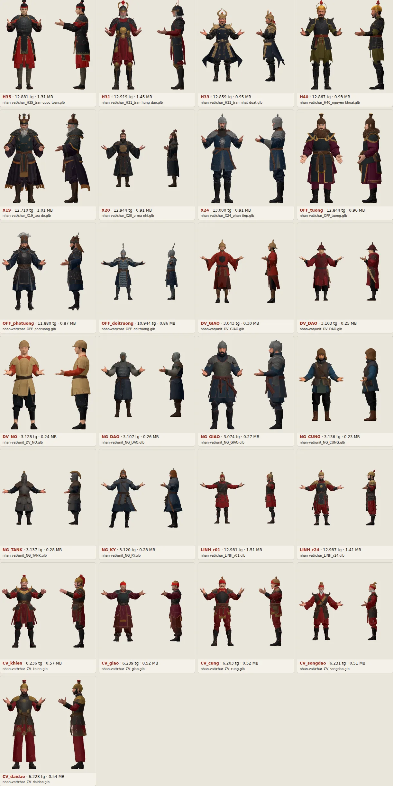
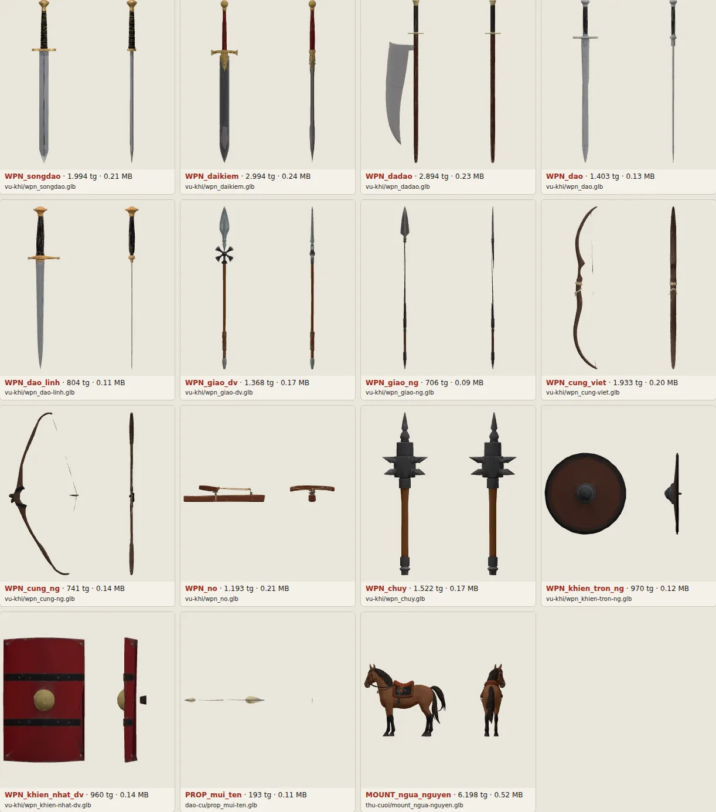

# GLB tạo bằng Meshy

Mẫu 3D tĩnh tạo bằng Meshy API từ đúng prompt trong `design/glb-prompts.md`. Nhân vật và vũ khí là **tệp riêng**: nhân vật tay không, vũ khí là một vật đứng một mình.

| Thư mục | Chứa | Tiền tố tệp |
| --- | --- | --- |
| `nhan-vat/` | Tướng, sĩ quan, người lính Tự do, cận vệ (`char_`), lính đám đông và dân làng (`unit_`) | `char_`, `unit_` |
| `vu-khi/` | Đao, kiếm, giáo, cung, nỏ, chùy, khiên | `wpn_` |
| `dao-cu/` | Mũi tên, cờ lưng, áo choàng, bành voi… | `prop_` |
| `thu-cuoi/` | Ngựa, voi | `mount_` |

`manifest.json` ghi từng tệp: mã task Meshy, model, số tam giác trước và sau khi nén, dung lượng, kích thước khung bao. Xem nhanh mọi mẫu: mở `xem.html` qua máy chủ tĩnh ở gốc repo (ví dụ `npx serve .` rồi vào `/design/glb/xem.html`). Ảnh tổng hợp nằm ở `xem-truoc/`.

## Tình trạng đợt đầu (2026-10-02)

Đã tạo đủ 40 tệp game hiện cần (`--set can`): 25 nhân vật, 13 vũ khí, mũi tên, ngựa cung kỵ. Tổng khoảng 21 MB (nhân vật 18 MB, tướng 0,9–1,5 MB, lính đám đông 0,25–0,3 MB, vũ khí 0,1–0,25 MB). Cả 40 tệp nạp được bằng `GLTFLoader` của game, không lỗi. Đã dùng hết 1100 credit Meshy: 45 cho cặp chạy thử, 485 dựng lưới lần đầu, 170 dựng lại các lưới hỏng, 400 tô texture.




Còn lệch so với `glb-prompts.md`, chưa làm lại vì hết credit:

| Tệp | Lệch | Cách xử lý đề xuất |
| --- | --- | --- |
| `char_H33` | Mũ vàng mọc cặp sừng (lần đầu thì đeo đao ở hông) | Cắt sừng khi rig, hoặc tạo lại khi có credit |
| `char_X19` | Mũ có hai chóp nhọn như sừng | Như trên |
| `unit_DV_DAO` | Bao đao ở hông trái; đội nón thay vì khăn đỏ quấn đầu | Xoá mảnh bao đao khi rig |
| `wpn_dadao` | Lưỡi lớn nằm cạnh cán thay vì ở đầu cán | Dời lưỡi lên đầu cán khi đặt trục vũ khí |
| `char_LINH_r01`, `char_CV_giao`, `char_CV_cung`, `char_CV_songdao` | Đội mũ trụ đỏ thay vì nón lá | Meshy chưa dựng được nón lá vành rộng; có thể gắn nón lá dựng bằng code |
| `unit_DV_GIAO`, `unit_DV_NO` | Nón chóp nhỏ, khác dáng nón trong prompt | Chấp nhận được ở cỡ lính đám đông |
| `char_OFF_photuong` | Mũ có mào tua tủa thay vì chóp xám bạc | Chấp nhận, hoặc tạo lại |
| `wpn_giao-dv` | Có một chùm cánh nhỏ dưới mũi giáo | Xoá khi đặt trục, hoặc giữ làm tua |
| Mọi nhân vật | Tay dang gần ngang hơn A-pose 45° của tài liệu | Rig vẫn dùng được |

Lính đám đông (nhóm C, D) và vũ khí, đạo cụ dùng meshy-5 cho vừa ngân sách; tướng, sĩ quan, người lính Tự do, cận vệ, ngựa, song đao và nỏ dùng model mới nhất (cột `model` trong `manifest.json`). Mặt nhân vật quay về +Z; ngựa quay theo trục X (xoay khi rig).

## Đã làm gì với tệp gốc của Meshy

Tệp gốc (texture PNG 2048, nặng) không đưa vào git. Công cụ nén chỉ làm ba việc:

- Texture màu đổi sang WebP 1024; riêng hai tướng chơi được (H35, H31) và người lính Tự do giữ 2048, vì camera bám sát họ suốt trận.
- Đặt gốc toạ độ ở giữa đáy (đứng trên mặt đất y = 0).
- Giảm lưới nếu Meshy trả quá dải tam giác của bảng mục 1.

Không đổi đơn vị, không xoay, không lượng tử hoá lưới. Chiều cao còn theo đơn vị của Meshy; chuẩn hoá mét, hướng +Z, gốc và trục vũ khí, `grip2` làm khi rig (mục 0.3 của `glb-prompts.md`).

## Đưa vào game: rig và nướng (`design/tools/glb-bake.mjs`)

Game không nạp GLB lúc chạy (bản deploy không có `GLTFLoader`). Công cụ nướng đọc `design/glb/*.glb` và ghi `game/assets/models/` (tệp `.hkm` lưới nhị phân + texture WebP, `index.json` liệt kê). Không cần mạng, không tốn credit.

```bash
cd design/tools && npm i && cd ../..
node design/tools/glb-bake.mjs all                 # hoặc char | kit | wpn, thêm --only H35,DV_GIAO
```

Bảng chọn cỡ lưới, texture, chỗ cầm và chiều vũ khí, hộp cắt phần thừa, khớp ghi tay, độ cao vai đã xem, số trọng số riêng mẫu: `design/tools/bake/catalog.mjs`. Mẫu mà lỗi của GLB không sửa được lúc nướng thì `keep: "35beed2"` giữ bản nướng cũ: `glb-bake.mjs` bỏ qua, `models.test.mjs` ghi TODO «GLB cần làm lại» (đang có OFF_tuong: tách tam giác cầu thì hở 0,25–0,68 m; lính DV_NO: nếp khuỷu LOD0) — tệp cũ 15 khớp vẫn chạy.

| Loại | Gắn vào | Cách làm (tệp trong `design/tools/bake/`) |
| --- | --- | --- |
| Tướng, sĩ quan, cận vệ, người lính Tự do (17) | 15 khớp của rig tướng (`battle/models.js` `makeRig`), cùng hoạt ảnh như trước, + 6 xương phụ chỉ lưới da dùng (`battle/rig-helpers.js`) | `landmarks.mjs` dò khớp, `human.mjs` kiểm tay, dựng khung gắn, trọng số, `char.mjs` ghi tệp (chi tiết dưới bảng). Tướng chơi được, người lính Tự do 9 nghìn tam giác, texture 1024; tướng khác, sĩ quan 5–6 nghìn, boss 7,5 nghìn, cận vệ 5 nghìn, texture 512 |
| Lính đám đông (8 kiểu, gồm cung kỵ) | Bộ khúc instanced (`soldier-motion.js`), vẽ bằng `soldiers.js` `glbKit` | `kit.mjs` đưa mẫu về tư thế nghỉ của bộ khúc (cùng trọng số mềm của `human.mjs`), mỗi đỉnh ≤ 2 khúc liền nhau, ghép vũ khí vào cẳng tay (cắt đoạn bao đao DV_DAO thò ra ngoài hông, đoạn áp áo giữ; neo tua giáo ở chân mũi, `meta.tas`). LOD0 (< 18 m) ~550–640 tam giác, texture 512 riêng; LOD1 (< 40 m) ~250–310, LOD2 ~100–145, tô màu đỉnh |
| Vũ khí (13) + mũi tên | Tay rig tướng, cẳng tay lính | `wpn.mjs` đặt gốc ở chỗ nắm, cán theo +Z, đúng chiều dài thật (chi tiết dưới bảng) |

Tướng, sĩ quan, cận vệ, người lính Tự do:

- Dò khớp (`landmarks.mjs`): đo đường dọc mặt lưới từ đầu ngón tay (tay đưa trước ngực, áo dài không lẫn); trục tay là tâm các vòng đẳng mức liền; khuỷu ở chỗ gập trong dải tỉ lệ cánh tay / cẳng tay hợp lý, hai tay cùng tỉ lệ; cổ dò dưới mũ.
- Kiểm tay (`human.mjs` `fitHuman`): cánh tay 0,18–0,40 m, cẳng tay 0,18–0,34 (mọi rig, cả đại kiếm WC01), hai tay lệch ≤ 25%, vai; vai dò phải trùng độ cao đã xem bằng mắt (`shoulder` trong `catalog.mjs`, ±0,03 khung thô) — bộ dò có thể ra một chuỗi tay tự khớp mà sai (DV_NO không khớp ghi tay: vai ở khuỷu), mẫu mới chưa ghi thì dừng nướng, báo số dò được. Tay hỏng: thay bằng tay kia đối xứng hay tỉ lệ người chỉ khi `catalog.mjs` cho (`fallback: true`); không thì dừng nướng, báo tên mẫu — thêm khớp ghi tay (đang có OFF_tuong, CV_daidao, lính DV_NO).
- Cắt phần thừa (sừng mũ H33, X19): tam giác có trọng tâm trong hộp cắt hoặc có đỉnh lọt vào hộp quá 0,8 cm.
- Khung gắn theo dáng tay của mẫu (bản lề khuỷu theo mặt gập khuỷu). Trọng số da mềm (`weights15`, số dải ở `WEIGHT_PRM`, mẫu nào cần thì `w` trong `catalog.mjs`): dải smoothstep theo chuỗi xương — eo tăng đều từ khớp đùi tới giữa ngực, bàn chân không theo hông, vạt áo dựa hông, giữa hai chân trên gối dần theo hông (vạt áo, váy lót không chia đôi theo hai đùi; `ky`: dải xuống dưới gối cho váy lót dài quá gối, H35, X20; `mirror`: trường khoảng cách tay lấy thêm tay kia soi gương — ống tay áo phải X19 rủ tới thắt lưng không còn theo thân) — rồi làm mượt trên lưới hàn, chỉ trộn xương kề nhau, ≤ 4 xương; mũ cứng theo đầu. Đảo trọng số (mảnh nhỏ của một khúc lọt trong khúc cách ≥ 3 đốt: cổ tay áo giáp theo thân) lấy trọng số quanh nó.
- Tam giác cầu (hai đỉnh có xương nặng nhất cách nhau ≥ 3 đốt — lưới Meshy dính bàn tay vào vạt áo, ống tay áo vào thân) tách trên lưới cuối (`splitBridges`): tư thế gắn y nguyên, hai phần rời nhau thì hở khe thay vì kéo màng — khe phải nhỏ: `rig-glb.test.mjs` kiểm đỉnh song sinh mỗi đường tách hở ≤ 3 cm ở 9 tư thế đặc trưng (trọng số đúng thì không còn tam giác cầu: X19 `mirror`, X20 `ky`).
- Xương phụ (`bindHelpers`): lưng (nửa góc thân), cổ (nửa góc đầu), xương đòn (gốc ở đầu xương ức, quay quanh trục trước ↔ sau của thân 15% phần tay giơ quá ngang vai — giơ ngang hay ra trước đều nhấc đỉnh vai), xoắn cẳng tay (nửa phần xoắn bàn tay).
- `char.mjs` ghi lưới da, vị trí vai, khuỷu, cổ tay, cổ riêng của mẫu (lúc chạy trùng khung gắn, kể cả H31 — tay phải tư thế WC01 giải lại theo số đo đó lúc chạy: `anim-wc01.js` `fitArms` — cả thanh gươm, hai nắm tay, mút chắn tay, ngón tay phải tránh lưới mặt của mẫu: `headShape` mũ, mặt cùng cổ, râu, cổ áo, `handPts`; tay ngắn nên thế giơ gươm qua đầu thành gươm dựng trước mặt, chắn tay nằm ngang), xương phụ (`meta.bones`, `meta.parent`, `meta.drive`, gốc trong `meta.rest`), đế giày (`meta.foot`). Lưới hàn, giảm đúng ngân sách, trải UV lại và nướng texture mới (`rebake.mjs`).

Lính đám đông: tam giác cầu theo khúc (cặp cấm như `kit-ke`: thân + cẳng tay, hai chân…) tách trên lưới gốc trước khi đưa về tư thế nghỉ (`kit.mjs` `kitBody` — đặt tay buông cũng là một tư thế: DV_NO cẳng tay áp sườn trước đây thành gai đỏ 0,3–0,55 m ngay trong lưới nghỉ) và lại ở mọi mức chi tiết; tua giáo nhỏ dần theo mức (36 / 20 / 12 tam giác); giáo, đao LOD2 đủ tam giác để còn cán, lưỡi (giáo binh Đại Việt LOD2 thân 100 tam giác: 90 thì mất hai tay, bóng chính diện còn 62% LOD0 — `models.test.mjs` `kit-bong`: LOD1, LOD2 ≥ 80%); NG_TANK giảm lưới giữ trọng số cẳng tay (`simp`: không còn tam giác mảnh vắt qua dải khuỷu); người cưỡi NG_KY trọng số tính trên thân đã ngồi (`riderBody`, `boot`: đế giày không theo đùi khi gập 90°, hết gai lưới nghỉ).

Vũ khí: kiếm, đao Meshy dựng mũi xuống — `flip`, tay nắm chuôi ngay dưới chắn tay (`meta.guard`: z chắn tay, gốc vệt chém, đoạn lưỡi né sọ của đại kiếm); đại đao nắm cán dưới đĩa chắn; giáo, đại đao ghi chân đầu (`meta.head`) để treo tua.

Lúc chạy, `game/js/battle/glb.js` nạp mô hình trong màn tải trận (`main.js` `loadModels`: tướng người chơi, lính, vũ khí, cận vệ, sĩ quan trước; phần còn lại tải ngầm). Mô hình nào chưa nạp được thì game dựng hình bằng code như cũ (không có xương phụ). Thân GLB: `glb.js` `bodyMesh` dựng xương phụ dưới khớp cha khi gắn thân; mỗi khung, lúc `scene.updateMatrixWorld` của trình vẽ (sau tư thế `anim.js`, IK `rig-motion.js`), xương phụ tự đặt góc từ quaternion cục bộ của khớp nguồn (`rig-helpers.js` `driveQuat`: lấy một phần góc, phần xoắn quanh trục xương, hay phần giơ quá ngang vai); hoạt ảnh, IK, `hitshape`, mô phỏng không biết tới xương phụ (20 rig: ~22 µs mỗi khung). Tệp nướng cũ (15 khớp) vẫn chạy như trước. Soát nhanh: `game/lab.html?view=state&s=idle&lod=0` (lính đám đông, `lod=1`, `2` cho mức xa), `lab.html?view=rigs` (tướng). Kiểm tự động trên tệp đã nướng (không cần node_modules): `node game/tests/models.test.mjs` (độ dài tay, vai, cổ, bản lề khuỷu, đế giày, phần cắt, chiều vũ khí, neo tua, trọng số, tam giác cầu `cau` / `kit-cau`, lính đám đông, xương phụ: đủ xương, khung gắn khớp bộ dẫn, cổ tay / eo xoắn không thắt); bộ dẫn: `node game/tests/rig-helpers.test.mjs`; đại kiếm trên số đo thật (tay trái tới chuôi, cả thanh gươm cách lưới mặt, khuỷu không nhảy, bàn tay không lật giữa hai khung), đường tách hở: `node game/tests/rig-glb.test.mjs`; trên GLB thật (cần node_modules): bộ dò tay sai đúng lý do, tư thế nghỉ lính (cả người cưỡi) không gai, trọng số lưng / cổ hỏng thì dừng — `node game/tests/bake-fit.test.mjs`.

## Tạo thêm hoặc làm lại

```bash
cd design/tools && npm i && cd ../..
export MESHY_API_KEY=...            # không ghi key vào repo
node design/tools/meshy.mjs balance
node design/tools/meshy.mjs list --only H34,H38 --prompt          # xem đúng prompt sẽ gửi
# Bước 1: chỉ dựng lưới xám, rồi ghép ảnh lưới để soát
node design/tools/meshy.mjs run --only H34,H38 --stage luoi
node design/tools/meshy.mjs sheet design/glb/_raw/to-xem.png --only H34,H38
# Lưới nào hỏng thì dựng lại: run --only H38 --redo H38 --stage luoi
# Bước 2: tô texture, tải và nén
node design/tools/meshy.mjs run --only H34,H38
```

`--set thu` là cặp thử H35 + song đao, `--set can` là 40 tệp game hiện cần (mặc định), `--set tat-ca` là cả 63 mục. Chạy lại chỉ làm phần chưa xong. Sửa prompt trong `glb-prompts.md` thì công cụ tự coi là mẫu mới.

Model: `--model` (mặc định `latest`) cho tướng, sĩ quan, người lính Tự do, cận vệ, ngựa; `--model-linh` cho lính đám đông và dân làng; `--model-vk` cho vũ khí, đạo cụ. Lần đầu đã dùng `--model-linh meshy-5 --model-vk meshy-5` để vừa ngân sách (lưới meshy-5 tốn 5 credit, `latest` tốn 20; texture 10). Song đao dùng `latest` vì bản meshy-5 ra dáng dao găm.

Prompt gửi API khác bản trong tài liệu ở ba chỗ, vì API v2 của Meshy bỏ qua `negative_prompt`: khối STYLE và POSE rút gọn; nhân vật thêm câu chặn "không vũ khí, không bao đao, không sừng, không áo choàng" (bản thử đầu của H35 tự mọc mũ có sừng kiểu kabuto và đeo hai thanh đao ở hông); ai không có mũ trong prompt thì thêm "No helmet."

Bản quyền: tệp tạo bằng gói Meshy trả phí thuộc người tạo; gói miễn phí theo CC BY 4.0 (phải ghi công Meshy). Ghi gói đã dùng vào `game/assets/SOURCES.md` khi đưa mẫu vào game.
